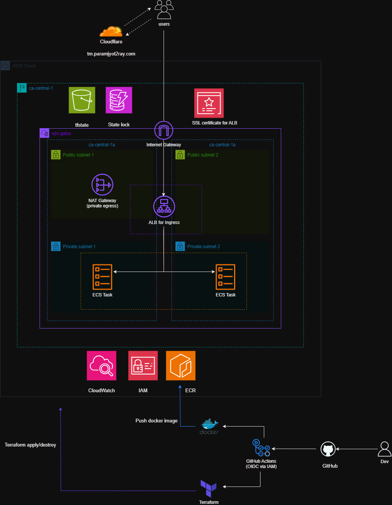

# Gatus Health Monitoring Platform on AWS ECS Fargate (AWS, Terraform, CI/CD)


A production-style container platform deployed on **AWS ECS Fargate**, using **Terraform** for infrastructure-as-code and **GitHub Actions** for secure CI/CD.  
The application runs **Gatus** behind an **Application Load Balancer (ALB)** with **HTTPS and a custom domain**, providing real-time health monitoring for internal and external services.


The platform runs inside a custom AWS VPC and follows standard AWS reference architecture patterns:

- Users access the platform via a custom domain over HTTPS
- Traffic flows through Cloudflare to an Application Load Balancer
- ECS Fargate runs the Gatus container in private subnets
- NAT Gateway provides outbound-only internet access
- Logs are streamed to CloudWatch
- CI/CD pipelines build and deploy images automatically


<p align="center">
  
</p>

---

## Table of Contents

- [Overview](#overview)
- [Tech Stack](#tech-stack)
- [Local Development](#local-development)
- [Design Priorities](#design-priorities)
- [Architecture Overview](#architecture-overview)
- [Repository Structure](#repository-structure)
- [CI/CD Workflow](#cicd-workflow)
- [Containers & Runtime](#containers--runtime)
- [IAM & Least Privilege Access](#iam--least-privilege-access)
- [Terraform & State Management](#terraform--state-management)
- [Observability](#observability)
- [Live Demo](#live-demo)
- [Future Improvements](#future-improvements)
- [What This Project Demonstrates](#what-this-project-demonstrates)

---

## Overview

This project demonstrates an end-to-end **ECS Fargate deployment** following real-world DevOps practices:

- Containerised application
- HTTPS via ALB + ACM
- Infrastructure defined entirely in Terraform
- CI/CD pipelines using GitHub Actions with OIDC (no static AWS credentials)
- Live health monitoring using Gatus

The emphasis is on **clarity, security, and operational correctness**, rather than unnecessary complexity.

---

## Tech Stack

### Cloud & Infrastructure
- AWS ECS (Fargate)
- Application Load Balancer (ALB)
- Amazon ECR
- AWS Certificate Manager (ACM)
- Amazon VPC
- CloudWatch Logs

### Infrastructure as Code
- Terraform
- Modular Terraform design
- Remote state stored in Amazon S3 (backend)
- State locking enabled using S3 lockfile (`use_lockfile = true`)
- Bootstrap stack provisions foundational resources (IAM, ECR, S3 backend)


### CI/CD
- GitHub Actions
- OIDC authentication (no long-lived AWS keys)

### Application & Runtime
- Gatus (Go-based monitoring tool)
- Docker (multi-stage build)
- Non-root container runtime

### DNS & HTTPS
- Cloudflare (DNS)
- Custom domain with HTTPS

---

## Local Development

This project uses the open-source Gatus monitoring engine:
```
https://github.com/TwiN/gatus
```
### Clone this repository

```bash
git clone https://github.com/Param2ray/ecs-production-healthcheck-service.git
cd ecs-production-healthcheck-service
```
### Run locally (Go)
```
cd app
go mod download
go run .
```
Verify:
```
curl http://localhost:8080/health
```
Expected response:
```
{"status":"UP"}
```
### Run locally with Docker

```
docker build -t gatus-local -f Docker/Dockerfile .
```
```
docker run -p 8080:8080 gatus-local
```
Verify:
```
curl http://localhost:8080/health
```


## Design Priorities

- Infrastructure defined as code (no ClickOps drift)
- Secure CI/CD using OIDC
- Least-privilege IAM roles
- Immutable container images (SHA-tagged)
- Simple, explainable architecture
- Production-style deployment flow

---

## Architecture Overview

The platform runs inside a custom AWS VPC and follows standard AWS reference architecture patterns:

- Users access the platform via a custom domain over HTTPS
- Traffic flows through an Application Load Balancer
- ECS Fargate runs the Gatus container
- Health checks monitor frontend, backend, internal, and external services
- Logs are streamed to CloudWatch
- CI/CD pipelines build and deploy images automatically
---

## Repository Structure
```
ecs-production-healthcheck-service/
├── .github/
│   └── workflows/
│       ├── build.yml            # Docker build, scan & push to ECR
│       ├── plan.yml             # Terraform plan (manual)
│       ├── apply.yml            # Terraform apply + post-deploy health check
│       └── destroy.yml          # Guarded teardown workflow
│
├── assets/
│   └── architecture.png         # Architecture diagram
│
├── app/                         # Gatus application source
│
├── config/                      # Gatus health check configuration
│
├── Docker/
│   ├── Dockerfile               # Multi-stage Docker build (optimized)
│   └── .dockerignore
│
├── terraform/                   # Runtime infrastructure
│   ├── main.tf
│   ├── provider.tf
│   ├── variables.tf
│   ├── terraform.tfvars
│   ├── terraform.auto.tfvars
│   └── modules/
│       ├── vpc/
│       ├── alb/
│       ├── ecs/
│       ├── iam/
│       ├── acm/
│       └── domain/
│
├── terraform-bootstrap/         # One-time foundational resources (IAM, ECR, S3 backend)
│   ├── main.tf
│   ├── variables.tf
│   ├── outputs.tf
│   ├── terraform.tfvars
│   └── versions.tf
│
├── README.md
└── .gitignore

```

---
## CI/CD Workflow

All pipelines authenticate to AWS using GitHub OIDC federation.  
No static AWS credentials are stored in GitHub.

---

### Docker Build & Push (`build.yml`)

- Triggered on application changes
- Builds multi-stage Docker image
- Tags image with commit SHA
- Scans image with **Trivy**
- Pushes image to Amazon ECR
- Fails on HIGH/CRITICAL vulnerabilities


---

### Terraform Plan (`plan.yml`)

- Manual trigger (`workflow_dispatch`)
- Runs **Checkov** for security validation
- Validates Terraform configuration
- Generates execution plan for review


---

### Terraform Apply (`apply.yml`)

- Manual trigger
- Verifies container image exists in ECR
- Applies infrastructure changes
- Deploys latest image
- Performs automated health check
- Pipeline fails if service is unhealthy


---

### Terraform Destroy (`destroy.yml`)

- Manual guarded teardown
- Requires confirmation input ("DESTROY")
- Uses restricted IAM permissions
- Prevents accidental infrastructure deletion


---

### Security & Validation

- **Trivy** scans container images before push
- **Checkov** validates Terraform security posture
- Failing scans prevent promotion to production

---
## Containers & Runtime

- Multi-stage Docker build
- Minimal runtime image
- Non-root container execution
- Reduced attack surface
- Optimised for ECS Fargate execution

### Docker Optimisation Result

Baseline image: **2.55GB**  
Optimised image: **80.4MB**

**2.55GB → 80.4MB (~97% reduction)**

Achieved using:
- Multi-stage build
- Distroless-style runtime
- Removal of unnecessary tooling
- Smaller attack surface


---

## IAM & Least Privilege Access

- Dedicated IAM role for CI/CD pipelines  
- Separate ECS task execution role  
- Policies scoped to minimum required permissions  
- IAM configuration fully managed via Terraform

---

## Terraform & State Management

- Modular Terraform structure for clarity and reuse  
- Remote state stored in Amazon S3  
- State locking enabled using S3 lockfile (`use_lockfile = true`)  
- Bootstrap stack provisions foundational resources (IAM, ECR, S3 backend bucket)  

---

## Observability

- Gatus provides real-time health monitoring  
- Endpoints grouped by:
  - External  
  - Frontend  
  - Backend  
  - Internal  
- ECS task logs shipped to CloudWatch  
- No manual logging configuration required  
---


---

## Live Demo

**Health Dashboard:**  
https://tm.paramjyot2ray.com

**Health Endpoint:**  
https://tm.paramjyot2ray.com/health


---

## Future Improvements

- Multi-environment deployments (dev / prod)  
- Promotion-based CI/CD workflows  
- CloudWatch alarms and metrics  
- Extended alerting integrations  
- Terraform refactoring using `for_each` and maps

---

## What This Project Demonstrates

- Real-world AWS ECS architecture design  
- Secure CI/CD using modern authentication patterns  
- Infrastructure that is easy to audit and reason about  
- Clear separation of concerns across the stack  
- Production-ready DevOps and cloud engineering practices


